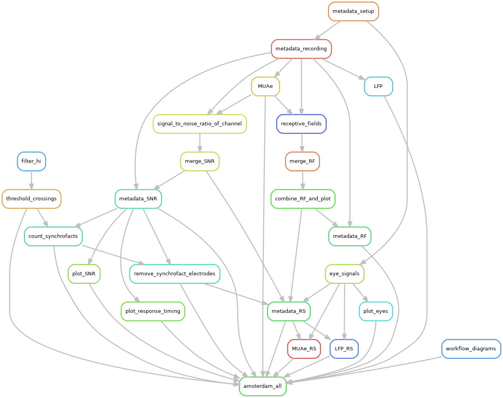

# Python scripts

This directory contains all python code used to preprocess the data. In
particular related to the metadata handling and cross talk removal (exclusively in
python).

## Dependencies

Code dependencies are provided in the `environment.yaml` file, including all packages and versions used. This file can be used to create a [conda](https://conda.io/projects/conda/en/latest/index.html) environment in your terminal:
```
conda env create -f environment.yaml
```
Which should create an environment named `rs_data`, which can be activate with conda:
```
conda activate rs_data
```

## Workflow

[Snakemake](https://snakemake.readthedocs.io/en/stable/) was used to create an executing workflow. Snakemake allows the creation of input-output dependencies. The rules contain specifications on the scripts that should be used and the environment where they should be executed, ensuring reproducible results. Snakemake also resolves the order of execution, based on the user specified dependencies. Also the different rule executions can be individually submitted as jobs into to a high performance computing (HPC) system. The following diagram shows the inter-dependencies of the rules used to process the data. An arrow shows an output to input dependency between different rules:



## Examples

### Data loading with NIX
The code uses the data structures from [python-neo](https://neuralensemble.org/neo/) and the files were saved to the [NIX](https://github.com/G-Node/nix) data format using the IO available in neo (NixIO). We provide an example on how to load a data file in a python script. Once the `block` object has been loaded the data will be available in the neo format. See the [neo core](https://neo.readthedocs.io/en/stable/core.html) for an overview.
```
import neo
from neo import NixIO

# Load the data
with NixIO('path_to_the_file.nix', mode='ro') as io:
    block = io.read_block()
    
# Finding the analog signals
anasig = block.segments[0].analogsignals

# Finding the task (or behaviour) epochs
epoch = block.segments[0].epochs[0]
```
The `analogsignals` contain the data signal, the `epochs` contain the event codes and times (useful to find the task trials or behavioural epochs). The `analogsignals` are annotated (notice that there are both `annotations` and `array_annotations`) with some of the metadata, such as the electrode ID, position or the signal to noise ratio (SNR). Note that `anasig` is a list:
```
# Print the annotations
print(anasig[0].annotations)
print(anasig[0].array_annotations)
```
The `annotations` and `array_annotations` are python dictionaries containing single values and arrays respectively.

### Metadata loading with odML
All the metadata from the experiments is compiled into a single file in the open metadata markup language ([odML](http://g-node.github.io/python-odml/)). This is a hierarchical structure (based on XML) and can easily be loaded in python:
```
import odml
metadata = odml.load('path_to_metadata.odml')
```
The metadata file has several sections which can easily be accessed:
```
# List sections
print(metadata.sections)
```
All sections have their own properties, which is where the actual metadata is located:
```
# Access the properties of one of the sections
print(metadata['Arrays'].properties)
```
Navigate the metadata tree in a similar manner to nested dictionary objects:
```
# Get some metadata subsection
trials = metadata['Recording']['Trials']

# Get a property directly from the subsection
SNR_thresh = metadata['Recording'].properties['SNR_threshold'].values[0]
```
The metadata can also be viewed using the [odml-ui](https://github.com/g-node/odml-ui) graphical interface.

See the [odML site](http://g-node.github.io/python-odml/) for more information about handling the metadata files.